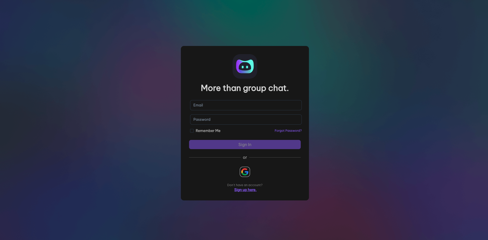

💅 Moobius is a group-driven social interaction platform which resembles Discord but has more features and flexibility.

⚡️ This library enables the front-end to quickly integrate the Moobius communication protocol, and supports both browser and Node.js environments, helping you quickly build your own customized [Moobius](https://moobius.net/login)

🧐 Check out the usage section for further information, including how to installation the project.
